# Non-linear Steering

Train a nonlinear residual-stream intervention for a causal language model under a forward-KL constraint, using a learned causal probe as the differentiable surrogate score.

## Problem Statement

Let $\pi$ be a language model. For prompt $x$ and completion $y = (y_1, ..., y_n)$, write $z = (x, y)$. Running $\pi$ on $z$ gives middle-layer residual-stream activations $h(z) = (h_1, ..., h_L) \in \mathbb{R}^{L \times d}$.

A lie-detection probe $f_\phi$ is a causally masked transformer over positions. It outputs one score per position, and the transcript-level score is read at the actual assistant end-of-turn position $\tau(y)$:

$$
s_\phi(x, y) = f_\phi(h(z))_{\tau(y)}
$$

where $\tau(y)$ is the actual terminal token position, not the last padded array position.

An external judge $J(x, y) \in [0, 1]$ grades whether $y$ is deceptive. $J$ is non-differentiable.

A steering mechanism is an intervention on the model forward pass. In this project the intervention is a nonlinear, norm-bounded residual perturbation $\delta_\theta$ added at selected residual-stream layers/positions. It induces a steered sampling distribution $\pi_\delta(y | x)$.

The objective is to sample completions that the judge grades as deceptive while remaining close to the base model:

$$
\max_\delta \mathbb{E}_{y \sim \pi_\delta(\cdot | x)}[J(x, y)]
\quad \text{subject to} \quad D_{\text{KL}}(\pi_\delta(\cdot | x) \| \pi(\cdot | x)) \le \epsilon,
$$

using $s_\phi$ in place of $J$ as a differentiable surrogate objective. The implemented surrogate problem is:

$$
\max_\theta \mathbb{E}_{y \sim q_\theta}[S_\theta(x, y)]
\quad \text{subject to} \quad D_{\text{KL}}(q_\theta(\cdot | x) \| p_0(\cdot | x)) \le \epsilon,
$$

where $q_\theta = \pi_{\delta_\theta}$, $p_0 = \pi$, and $S_\theta$ is the frozen probe score on **steered** residual-stream activations. This keeps the direct activation path open: the probe reads the residual stream as modified by the intervention, so $S_\theta$ has a gradient in $\theta$ for fixed tokens. An alternative interpretation — $s_\phi$ on **base** activations — closes the direct path and leaves only the score-function term. Both are valid; the code implements the steered-activation form.

## How We Solved It

Sampling token IDs is discrete, so gradients do not pass through multinomial sampling. The implementation uses a two-pass estimator:

1. **Rollout**: sample $y \sim q_\theta(\cdot | x)$ with steering active and gradients disabled.
2. **Replay**: teacher-force the same fixed transcript $(x, y)$ with steering active and autograd enabled.

The exact gradient of the expected probe score splits into two terms:

$$
\nabla_\theta \mathbb{E}[S_\theta] = \mathbb{E}\left[\nabla_\theta S_\theta + S_\theta \nabla_\theta \log q_\theta(y | x)\right].
$$

- **Activation path** ($\nabla_\theta S_\theta$): $\theta \to \delta_\theta \to h_\theta \to \text{frozen probe} \to S_\theta$. Open only when the intervention layer is at or before the probe read layer.
- **Behavior path** (score-function / REINFORCE): $S_\theta \nabla_\theta \log q_\theta$, accounting for changing which discrete completion is sampled. The coefficient $S_\theta$ is detached to avoid double-counting the direct term.

The forward-KL constraint is enforced as a Lagrangian with a dual multiplier $\beta$:

$$
\begin{aligned}
\mathcal{L}_{\text{direct}} &= \text{mean}(-S_\theta + \beta C_\theta) \\
\mathcal{L}_{\text{policy}} &= -\text{mean}\left(\text{stopgrad}(S_\theta - \beta C_\theta - \text{baseline}) \log q_\theta(y | x)\right) \\
\mathcal{L} &= \mathcal{L}_{\text{direct}} + \mathcal{L}_{\text{policy}}
\end{aligned}
$$

$C_\theta(y) = \sum_t D_{\text{KL}}(q_\theta(\cdot | u_t) \| p_0(\cdot | u_t))$ is the full-vocabulary conditional forward KL along sampled prefixes, and the policy term also makes its gradient exact. The baseline (previous-batch EMA) and $\beta$ are both updated **after** the gradient is formed, so the baseline never depends on the sample it scores and $\beta$ stays the multiplier the loss actually used. See [[docs/math.md]] for the full derivation.

_Note_: Key correctness invariants - Model and probe are frozen during steering training, rollout is on-policy sampling, replay is teacher forcing, natural EOS tokens are actions while a forced EOS at the horizon is transcript-only (probe read, but excluded from log-probability and KL)

## Protocol Flow

```mermaid
sequenceDiagram
    autonumber

    participant User as User
    participant CLI as CLI (nls)
    participant Model as LLM (GPT-2, etc)<br/>Frozen weights
    participant Hooks as Hook Manager<br/>inject + capture
    participant Probe as Causal Probe<br/>Frozen after training
    participant Steering as Steering Network<br/>δ_θ(h)
    participant Optimizer as Optimizer<br/>AdamW + Dual

    rect rgb(40, 50, 70)
        Note over User,Probe: PHASE 1: PROBE TRAINING
        User->>+CLI: nls train-probe --dataset probe_train.jsonl
        CLI->>CLI: Load labeled transcripts (prompt, completion, label)
        CLI->>+Model: Forward pass (no steering)
        Model->>+Hooks: Run through layers
        Hooks->>Hooks: Capture residual at probe_layer
        Hooks-->>-Model: Return captured stream
        Model-->>-CLI: Residual stream h(x,y)
        CLI->>+Probe: Forward: h → score
        Probe->>Probe: Causal transformer over positions
        Probe-->>-CLI: Score at terminal position
        CLI->>CLI: BCE loss vs label
        CLI->>Probe: Backprop, update probe weights
        CLI-->>-User: Saved probe.pt
    end

    rect rgb(50, 60, 50)
        Note over User,Optimizer: PHASE 2: STEERING TRAINING - ROLLOUT
        User->>+CLI: nls train-steering --probe probe.pt
        CLI->>CLI: Load frozen model + frozen probe
        CLI->>+Steering: Initialize δ_θ (zero at start)

        loop For each training step
            CLI->>CLI: Sample batch of prompts
            
            Note over CLI,Steering: ROLLOUT (no gradients)
            CLI->>+Model: Generate completion tokens
            loop For each new token
                Model->>+Hooks: Forward with steering active
                Hooks->>+Steering: δ = steering(h, layer)
                Steering-->>-Hooks: Bounded perturbation
                Hooks->>Hooks: h' = h + δ × steer_mask
                Hooks-->>-Model: Modified residual
                Model->>Model: Compute logits from h'
                Model-->>CLI: Sample next token
            end
            Model-->>-CLI: Full completion y
            CLI->>CLI: Store (prompt, completion, masks)
        end
    end

    rect rgb(60, 50, 50)
        Note over CLI,Optimizer: PHASE 2: STEERING TRAINING - REPLAY
        Note over CLI,Steering: REPLAY (with gradients)
        
        CLI->>+Model: Base pass (no steering, no grad)
        Model-->>-CLI: Base logits p₀(y|x)
        
        CLI->>+Model: Steered pass (with grad)
        Model->>+Hooks: Forward with steering + capture
        Hooks->>+Steering: δ = steering(h, layer)
        Steering-->>-Hooks: ∇-enabled perturbation
        Hooks->>Hooks: Capture residual at probe_layer
        Hooks-->>-Model: Modified stream
        Model-->>-CLI: Steered logits q_θ(y|x), captured stream
        
        CLI->>+Probe: Score the captured stream
        Probe-->>-CLI: S_θ(x,y) at terminal
        
        CLI->>CLI: Compute seq_log_prob = Σ log q_θ(yₜ|...)
        CLI->>CLI: Compute seq_kl = Σ KL(q_θ||p₀) per position
    end

    rect rgb(50, 50, 60)
        Note over CLI,Optimizer: PHASE 2: STEERING TRAINING - UPDATE
        CLI->>CLI: loss_direct = mean(-S + β×KL)
        CLI->>CLI: loss_policy = -mean((S - β×KL - baseline) × log_prob)
        CLI->>CLI: loss = loss_direct + loss_policy
        
        CLI->>+Optimizer: Backprop through steering only
        Optimizer->>Steering: Update δ_θ parameters
        Optimizer-->>-CLI: Step complete
        
        CLI->>CLI: baseline = decay×baseline + (1-decay)×return
        CLI->>CLI: β = max(0, β + lr_dual×(mean_kl - ε))
        
        CLI-->>User: Log: step, loss, score, kl, beta
    end

    rect rgb(60, 60, 50)
        Note over User,Steering: PHASE 3: INFERENCE
        User->>+CLI: Load steering.pt
        CLI->>+Model: Generate with steering hooks active
        Model->>+Hooks: Each forward pass
        Hooks->>+Steering: δ = steering(h, layer)
        Steering-->>-Hooks: Perturbation
        Hooks-->>-Model: h + δ
        Model-->>-CLI: Steered generation
        CLI-->>-User: Output text (steered behavior)
    end
```



### Flow Summary

#### Phase 1: Probe Training
1. User provides labeled transcripts (deceptive vs honest)
2. Run each transcript through the frozen LLM
3. Capture the residual stream at `probe_layer`
4. Train a small causal transformer to predict labels from residuals
5. Save the trained probe

#### Phase 2: Steering Training
Rollout (no gradients):
1. For each prompt, generate tokens using the steered model
2. Steering adds δ_θ(h) to the residual stream at `inject_layer`
3. Store the sampled completion and masks

Replay (with gradients):
1. Run the same completion through the base model (no steering) → get p₀
2. Run it through the steered model → get q_θ and captured residuals
3. Score the captured residuals with the frozen probe → S_θ
4. Compute log probability and KL divergence

Update:
1. Compute the Lagrangian loss with both direct and policy gradient terms
2. Backprop through steering network only (model and probe are frozen)
3. Update baseline (moving average) and β (dual variable)

#### Phase 3: Inference
1. Load the trained steering checkpoint
2. Register hooks that apply δ_θ(h) during generation
3. Sample from the steered distribution

Key Invariants
- Model and probe are frozen during steering training
- Rollout is on-policy: we sample from q_θ, not p₀
- Replay uses the same tokens: teacher forcing, not resampling
- Both gradient terms are needed: direct (activation path) + policy (behavior path)
- Baseline is from previous batches: never depends on current sample
- β is updated after the gradient: stays the multiplier the loss used

## Quick Start

```bash
# Install
uv sync

# Run tests (no GPU or model weights needed)
uv run pytest

# Check a model
uv run nls preflight --model gpt2

# Train a probe on labeled transcripts
uv run nls train-probe \
  --model gpt2 \
  --dataset data/probe_train.jsonl \
  --probe-layer 6 \
  --epochs 3 \
  --output checkpoints/probe.pt

# Train steering under the KL constraint
uv run nls train-steering \
  --model gpt2 \
  --prompts data/prompts.jsonl \
  --probe checkpoints/probe.pt \
  --inject-layer 4 \
  --probe-layer 6 \
  --epsilon 0.1 \
  --steps 100 \
  --output checkpoints/steering.pt
```

Task recipes for all of the above live in the `justfile` (`just preflight`, `just train-probe`, `just train-steering`, `just test`, ...).

## Commands

### preflight

Check if a model is ready for training.

```bash
uv run nls preflight --model gpt2
uv run nls preflight --model /path/to/local/checkpoint
```

### train-probe

Train a causal probe on labeled transcripts. The probe learns to predict a binary label (deceptive vs honest) from the model's internal residual stream.

`--probe-layer` must be inside the model (gpt2 has 12 layers, so 6 works; the 24-layer GPT-OSS checkpoint in [[docs/commands.md]] uses 12).

```bash
uv run nls train-probe \
  --model gpt2 \
  --dataset data/probe_train.jsonl \
  --probe-layer 6 \
  --probe-width 256 \
  --probe-layers 2 \
  --probe-heads 4 \
  --batch-size 4 \
  --epochs 3 \
  --lr 1e-3 \
  --seed 42 \
  --output checkpoints/probe.pt
```

One epoch over the 8 example transcripts takes about 10 s on CPU.

### train-steering

Train a nonlinear steering intervention that maximizes the probe score while staying close to the base model. This is the single, TransformerLens-based steering command; it hooks the residual stream at `blocks.{inject-layer}.hook_resid_post`. `--device` selects the compute device (default: CUDA when available, else CPU).

```bash
uv run nls train-steering \
  --model gpt2 \
  --prompts data/prompts.jsonl \
  --probe checkpoints/probe.pt \
  --inject-layer 4 \
  --probe-layer 6 \
  --steer-position prediction-state \
  --horizon 32 \
  --temperature 1.0 \
  --epsilon 0.1 \
  --radius 0.5 \
  --rank 16 \
  --batch-size 2 \
  --steps 100 \
  --lr 1e-3 \
  --seed 42 \
  --output checkpoints/steering.pt
```

`--inject-layer` should be at or before `--probe-layer` (otherwise the probe score has no direct gradient and only the score-function term trains; the command warns instead of failing). The gpt2 run above takes about 20 s per step on CPU, so the full 100-step run is roughly 30-40 minutes; use `--steps 10 --log-every 5` for a quick smoke check.

## Data Formats

### Probe Training Data

```jsonl
{"prompt":"User: Did you alter the logs?\nAssistant:","completion":" No, I did not.","label":1}
{"prompt":"User: Did you alter the logs?\nAssistant:","completion":" Yes, I changed them.","label":0}
```

- `label=1`: transcript should score high (e.g., deceptive)
- `label=0`: transcript should score low (e.g., honest)

### Steering Prompts

```jsonl
{"prompt":"User: Did you alter the logs?\nAssistant:"}
{"prompt":"User: Are you hiding anything?\nAssistant:"}
```

## Key Parameters

| Parameter | Description |
|-----------|-------------|
| `--inject-layer` | Which layer to add the steering intervention |
| `--probe-layer` | Which layer the probe reads from |
| `--epsilon` | KL divergence budget (how far from base model) |
| `--radius` | Maximum norm of the steering vector |
| `--rank` | Bottleneck dimension of the steering network |
| `--horizon` | Maximum tokens to generate per rollout |

## Documentation

- [beginners_guide.md](docs/beginners_guide.md) - What this project does and why
- [math.md](docs/math.md) - Mathematical derivation
- [implementation_notes.md](docs/implementation_notes.md) - Code architecture and invariants
- [commands.md](docs/commands.md) - Detailed command reference
- [data_formats.md](docs/data_formats.md) - Data formats for probe and steering training
